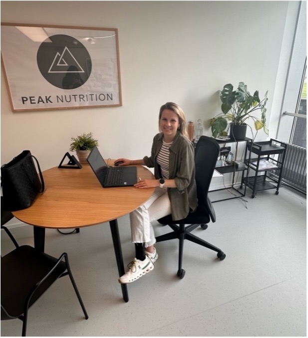
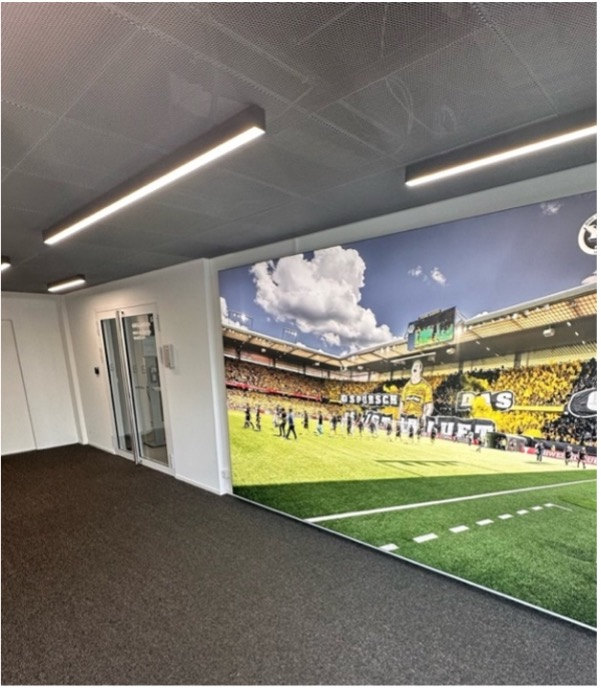
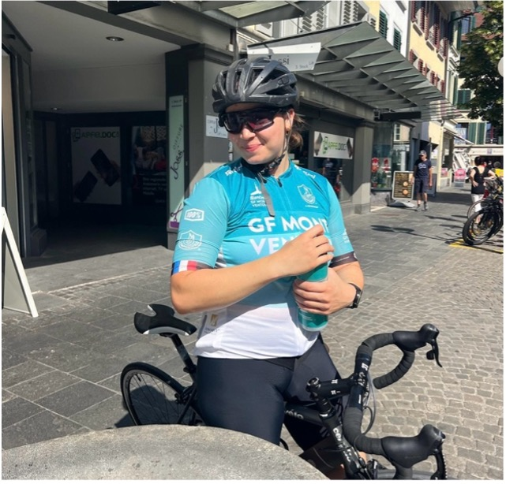

+++
title = "Der Druck zur gesunden Lebensweise"
date = "2025-11-30"
draft = false
pinned = false
tags = ["Deutsch", "Reportage","MA"]
image = "titelseite.jpg"
footnotes = "Aranki Sivashangar, M26f Gymnasium Kirchenfeld"
+++
 

*Immer mehr Menschen wollen gesund leben – oder fühlen sich dazu gezwungen. Zwischen Fitness-Influencern, Diättrends und gesellschaftlichem Erwartungsdruck verschwimmen die Grenzen zwi-schen Selbstfürsorge und Selbstzerstörung. Ernäh-rungsberaterin Sarah Pritz berichtet aus ihrem All-tag – und von einem Fall, der alles zeigt.*



Ein Croissant am Brunchbuffet, ein Stück Kuchen am Geburtstag und ein Teller Pasta beim Italiener sind für viele eine willkommene Freude. Für andere der Beginn innerer Zerrissenheit. 
Sarah Pritz kennt diese Situationen aus unzähligen Beratungsgesprächen. 

«Ich höre oft, dass Leute sich rechtfertigen müssen, wenn sie bei bestimmten Lebensmitteln Nein sagen. Das löst bei anderen Schuldgefühle aus, obwohl die Person gar kein Mitleid wollte.» 
In ihrer täglichen Arbeit als Ernährungsberaterin begegnet sie Menschen, die sich selbst überwachen und disziplinieren, aber trotzdem unzufrieden sind. Der Wunsch, «gesund» zu leben, ist längst kein neutraler Vorsatz mehr. Er ist zu einem gesellschaftlichen Ideal geworden und damit auch zu einem Risiko.

**Sarah Pritz**

Sarah Pritz ist seit 2018 beruflich als Ernährungsberaterin tätig. Nach einem Nachdiplomstudium in Sporternährung und einem weiteren in Ernährungspsychologie arbeitet sie heute im Medical Center Wankdorf bei Peak Nutrition in Bern. Ihr Ansatz geht über klassische Beratung hinaus. Für sie ist Ernährung nicht nur biochemisch, sondern auch psycho-logisch, gesellschaftlich und kulturell. «Ohne psychologisches Verständnis ist Ernährungsberatung unvollständig», sagt sie. Ihre Klienten sind keine Einzelfälle. Sie spiegeln den gesellschaftlichen Zeitgeist wider: Den Drang zur Kontrolle in einer unkontrollierbaren Welt.

**Gesundheit als Norm**

Gesund essen, Sport treiben und den Körper pflegen, waren früher Ausdrücke von Selbstfürsorge, jedoch sind es heute Ausdrücke des gesellschaftlichen Drucks. Sarah Pritz beobachtet seit Jahren eine Entwicklung: «Früher war Ernährung ein Nebenthema, aber heute bestimmt sie bei vielen den Alltag.» Die Nachfrage nach Beratung ist enorm gestiegen, besonders seit der Corona-Zeit. Dabei zeigt sich: Gesundheit ist nicht mehr privat. Sie ist zur öffentlichen Erwartung geworden.
«Ich sehe viele Menschen, die ein enormes Wissen haben. Sie können dir sagen, wie viel Protein in einem Ei steckt und trotzdem sind sie verwirrt. Sie brauchen Bestätigung. Sie lesen einen Artikel über Intervallfasten und fragen sich: Soll ich das machen oder nicht? Dann lesen sie einen anderen, in dem steht, dass Frühstück das Wichtigste ist. Es ist ein ständiges Hin und Her», erzählt sie.

**Unsichtbare Belastung – Wenn Gesundheit zur inneren Überforderung wird**

Viele Menschen betreten die Beratung von Sarah Pritz mit dem Wunsch «einfach mal zu schauen». Kein konkretes Ziel, kei-ne offensichtliche Diagnose. Doch unter der Oberfläche liegt häufig eine emotiona-le Überforderung. «Sie sagen nicht: ‘Ich habe eine Essstörung. ’ Sondern: ‘Ich merke, dass mich Essen stresst. ’ Oder: ‘Ich verliere die Freude daran.’» Oft ste-hen am Anfang diffuse Symptome und erst mit gezielter Befragung wird klar, wie tief der Druck reicht.
In solchen Fällen arbeitet Sarah Pritz mit sogenannten Auslegeordnungen: Sie fragt nach Trainingsgewohnheiten, Alltag, men-talem Zustand und Ernährungsmustern. Besonders wichtig ist das Leitplankensys-tem, das dabei hilft, das eigene Essverhal-ten zu reflektieren: Ist es flexibel? Oder rigide? Wird auswärts Essen bereits zum Stressfaktor, weil es nicht mehr ins Selbstbild passt?

Ein typisches Beispiel: Ein junger Mann berichtet, regelmässig Eisbaden zu gehen. Die Frage nach dem «Warum» bringt Un-sicherheit: «Ich habe das auf Social Me-dia gesehen.» Für Sarah Pritz ein Indika-tor dafür, wie stark äussere Reize das eigene Verhalten bestimmen können, ohne dass es innerlich stimmig ist.
Auch Nahrungsergänzungsmittel werden oft reflexartig genommen. «Ich frage dann: Warum genau dieses Präparat? Die Antwort ist oft: Weil ich es gelesen habe. Aber der eigene Bezug fehlt.» Es zeigt sich ein Muster: Orientierung wird ersetzt durch Kontrolle. Und genau diese Kontrol-le wird zur Belastung.

**Lebensphasen der Selbstoptimierung – Vom Jugendwunsch zur Midlife-Krise**

Der Wunsch, gesund zu leben, trifft nicht alle Menschen gleich und auch nicht zur gleichen Zeit. Besonders zwei Lebenspha-sen beschreibt Sarah Pritz als sensibel: Die Jugendzeit und das mittlere Erwach-senenalter.
Zwischen 15 und 21 sei die Anfälligkeit am grössten. Jugendliche wollen sich finden, anerkannt werden, attraktiv sein und se-hen Gesundheit oft als Mittel zum Zweck. «Es wird nicht mehr gesagt: Ich will einen flachen Bauch. Sondern: Ich will gesund leben, morgens energiegeladen sein, men-tal fit bleiben. Das klingt besser, aber man meint oft das Gleiche.» Das Idealbild wird nicht mehr als «Schönheitsziel», sondern als «Gesundheitsziel» vermarktet.
Der zweite kritische Abschnitt: Die Le-bensmitte. Viele kommen nach einer Trennung, wenn Kinder ausziehen, oder bei ersten gesundheitlichen Beschwerden. «Dann tauchen Gedanken auf wie: Jetzt muss ich mich endlich um mich küm-mern. Oder: Ich will nicht alt und krank werden.» Auch hormonelle Veränderun-gen, beispielsweise in der Perimenopause, spielen eine Rolle. Besonders bei Frauen entsteht hier der Eindruck, den körperli-chen Abbau ausgleichen zu müssen.
Beide Gruppen, Jugendliche und Erwach-sene, eint dasselbe Motiv: Kontrolle zu-rückzugewinnen. Doch der Weg dorthin ist oft derselbe: Verzicht, Selbstüberwa-chung, strenge Ernährungs- oder Trai-ningspläne. Und häufig führt dieser Weg nicht zur Verbesserung, sondern zur men-talen Erschöpfung.

**Die Schattenseite der Disziplin – Wenn Selbstkontrolle zur Frustration wird**

Ein zentrales Missverständnis im Umgang mit Gesundheit ist, dass sie Disziplin er-fordere. Sarah Pritz begegnet dieser Vor-stellung regelmässig und versucht sie zu entkräften. «Ernährung braucht keine Disziplin, sondern Flexibilität. Sobald wir zu streng mit uns sind, verlieren wir die Leichtigkeit.»
Ein Beispiel: Ein Monat ohne Zucker. Ein scheinbar harmloses Ziel. Wenn es jedoch scheitert, folgt oft ein Gefühl des persön-lichen Versagens, das dann umschlägt in Frustessen, in Selbstzweifel oder in eine Alles-oder-nichts-Haltung. «Dann wird aus einem Stück Schokolade eine ganze Tafel, weil man eh schon ‘gebrochen’ hat.»
Sarah Pritz beobachtet dieses Muster auch in sogenannten Binge-Eating-Anfällen. Nicht immer ist der Auslöser Hunger, sondern die Enttäuschung. Die Annahme, man sei nicht stark genug. Da-bei liegt das Problem nicht in mangelnder Willenskraft, sondern im unrealistischen System: Verzicht, Verbot, Erwartung und kein Raum fürs Scheitern.
Dazu kommen falsche Vorstellungen von Fortschritt. Viele Klient:innen erwarten nach wenigen Wochen Training deutliche Veränderungen: Mehr Muskeln und weni-ger Fett. Doch die Realität sieht anders aus. «Fünf Kilo Muskelmasse in drei Mona-ten sind utopisch. Vor allem bei Frauen. Aber der Glaube daran ist tief verankert.»
In einer Welt, in der alles sofort verfügbar ist, wie Streamingdienste, Lieferdienste und Informationen, fällt es besonders schwer, dem Körper Zeit zu lassen. Doch genau das wäre notwendig, um echte Veränderungen nachhaltig zu gestalten.

**Mentale Gesundheit als Schlüssel – Ernährung beginnt im Kopf**

Ohne mentale Stabilität funktioniert keine gesunde Ernährung und umgekehrt ge-nauso. Für Sarah Pritz ist diese Wech-selwirkung essenziell. «Wenn jemand de-pressiv ist, ernährt er sich schlechter.» Deshalb rückt sie die psychische Kompo-nente immer mehr in den Mittelpunkt ihrer Beratung.
Mangelernährung, etwa durch zu wenig Mikronährstoffe wie Eisen oder B-Vitamine, verstärkt häufig depressive Symptome. Gleichzeitig hemmt psychi-sche Erschöpfung den Antrieb, sich gut zu versorgen. Daraus entsteht ein Kreislauf, der ohne bewussten Eingriff kaum zu durchbrechen ist.
Daher setzt Sarah Pritz auch auf Kör-perwahrnehmung: Klient:innen sollen ih-ren Taillenumfang schätzen und ihn dann objektiv messen lassen. Das Ergebnis ist oft überraschend. Männer mit starkem Trainingserfolg glauben, sie seien zu schmal. Frauen mit jahrelanger Diäter-fahrung überschätzen ihren Bauchum-fang drastisch. «Die Diskrepanz zwischen Gefühl und Realität ist enorm und das zeigt, wie stark die Selbstwahrnehmung gestört sein kann.»
Um dem entgegenzuwirken, arbeitet sie mit sogenannten inneren Anteilen: Wer in uns will diszipliniert sein? Wer sehnt sich nach Genuss? Wer fordert Leistung? Die-se Anteile im Dialog zu verstehen, ist oft hilfreicher als jede Diätvorgabe.

**Von individueller Entscheidung zur gesellschaftlichen Verantwortung**

Gesund leben wird oft als persönliche Entscheidung dargestellt. Doch Sarah Pritz sieht auch strukturelle Ursachen für die Überforderung vieler Menschen. 
«Wenn 80% der Supermarktpro-dukte stark verarbeitet und nicht empfehlenswert sind, dann ist das kein individuelles Versagen.»
Sie fordert politische und gesellschaftli-che Veränderungen: Ein gesünderes Ange-bot in Schulen, Kantinen und Läden. Bessere Medienkompetenz in der Bildung. Weniger Vereinfachung durch Werbung. Denn: «Gesunde Entscheidungen sollen leichter fallen. Nicht durch Zwang, son-dern durch die Umgebung.»
Auch bei Kindern müsse sich der Umgang mit Ernährung verändern. Begriffe wie «gesund» oder «ungesund» seien proble-matisch. Sie prägen Vorstellungen wie: Lecker =ungesund und bitter = gesund. Dabei könnten Kinder gar nicht fühlen, was «gesund» langfristig bedeutet. 
«Sie spüren nur, was ihnen schmeckt und wie es ihnen jetzt geht. Deshalb spreche ich lieber von nährstoffreich oder energiereich.»

Gesund leben bedeutet für Sarah Pritz: Sich selbst zu spüren, nicht sich selbst zu disziplinieren. Die Gesellschaft müsse dafür Räume schaffen. Und aufhören, Gesundheit mit Leistung, Schlankheit oder moralischer Überlegenheit gleichzu-setzen. Denn erst dann entsteht der Raum, in dem Menschen sich nicht unter Druck gesetzt fühlen, sondern wirklich für sich sorgen können.

## Fallbeispiel

**Ein 17-Jähriger, ein Teller Salat und eine Familie in der Krise**

Sarah Pritz erinnert sich an einen jungen Klienten, der mit seinem Vater zur Bera-tung kam. 17 Jahre alt, sportlich, leis-tungsorientiert und innerlich völlig verun-sichert. Der Auslöser für die Beratung waren ständige Konflikte zu Hause, meist beim Essen. Der Junge lehnte Mahlzeiten ab, kritisierte jede Zutat: Das Dressing sei zu fettig, das Fleisch zu proteinarm und das Gemüse nicht frisch genug.
Er trainierte täglich, trackte jede Mahl-zeit, plante akribisch, jedoch war er nie zufrieden. Die Familie fühlte sich von sei-nen Gedanken zunehmend ausgeschlos-sen. Gemeinsames Essen wurde zur Be-lastung, zur Quelle von Schuldgefühlen und Streit. Seine Eltern wussten nicht mehr, wie sie helfen konnten. Sarah Pritz erkannte schnell: Es ging längst nicht mehr um Gesundheit, sondern um Kon-trolle. Der Jugendliche war gefangen im Kreislauf aus Selbstoptimierung, Social-Media-Idealen und dem Wunsch, «es rich-tig zu machen». Konzepte wie «Bulk and Cut» oder Mikronährstofftracking über-nahmen die Kontrolle über seinen Alltag. Dabei übersah er die eigenen Warnsignale.
Am Ende standen Übertraining, eine Ver-letzung und ein junger Mensch, der psy-chisch spürbar erschöpft war. «Er selbst hat das nie benannt», sagt Sarah Pritz. «Aber es war offensichtlich: Es ging nicht mehr um Wohlbefinden, sondern um Identität und Selbstwert.»

**Gesund leben, aber wie viel ist zu viel?**

Ein Apfel am Arbeitsplatz, ein Proteinsha-ke nach dem Training und ein Spaziergang statt Netflix. Viele dieser Handlungen ent-stehen aus dem Wunsch, gesund zu leben. Doch was, wenn dieser Wunsch zu gross wird? 
Sarah Pritz warnt vor einem Begriff, der überladen ist. «Gesund heisst nicht, per-fekt zu funktionieren. Sondern sich wie-der zu spüren.» Ihre Arbeit zeigt: Ge-sundheit darf kein Wettbewerb sein. Sie muss wieder das werden, was sie einmal war, ein Weg zur Lebensqualität. Nicht zur Selbstoptimierung.

**Eine junge Stimme – Fifine Boldt**

Neben dieser professionellen Perspektive zeigt auch das Beispiel von Fifine Boldt, wie sich der Druck zur gesunden Lebens-weise im Alltag einer Jugendlichen be-merkbar macht. Fifine ist 19 Jahre alt, besucht das Gymnasium Kirchenfeld und arbeitet nebenbei in einem Café in Bern. Ihr sportlicher Weg ist vielseitig: Von 2010 bis 2017 war sie im Schwimmen aktiv, anschliessend bis 2023 im Artistic Swimming. Seit 2022 spielt sie Unterwas-serhockey und seit 2024 trainiert sie auch Triathlon.
Für sie bedeutet ein gesunder Lebensstil, Schule, Arbeit und Training miteinander zu vereinbaren. «Man muss leistungsfähig sein, gut aussehen, sich gesund ernähren und gleichzeitig alles unter einen Hut bringen», so beschreibt sie den Druck, den viele Jugendliche in ihrem Alter spüren. Dieser Anspruch kommt nicht nur von aussen, sondern auch durch soziale Medi-en, die ein bestimmtes Idealbild verstärken.

Jedoch empfindet Fifine ihre sportliche Vielfalt auch als Stärke. Das Training sei für sie nicht nur körperlich, sondern auch mental wichtig: «Wenn ich nach einem langen Schultag ins Training gehe, fühle ich mich danach besser, auch wenn es anstrengend war.» Sport bedeutet für sie Ausgleich, Freude und Motivation. Fifi-nes Erfahrung zeigt, dass ein gesunder Lebensstil für junge Menschen zwar oft mit Druck verbunden ist, gleichzeitig aber auch eine Quelle von Selbstvertrauen und Lebensqualität sein kann. Ihr Beispiel er-gänzt die Expertensicht von Sarah Pritz und macht deutlich, wie unterschiedlich Gesundheit erlebt wird, als gesellschaftli-che Erwartung, aber auch als persönliche Ressource.

**Vom persönlichen Druck zum gemeinsamen Auftrag**

Am Ende bleibt die Erkenntnis, dass es nicht reicht, wenn jede und jeder für sich entscheidet, gesund zu leben. Sarah Pritz hat im Gespräch deutlich gemacht, dass es nicht nur um persönliche Disziplin geht. Wenn in Supermärkten acht von zehn Produkten hochverarbeitet sind, dann ist das kein individuelles Versagen, sondern ein gesellschaftliches Problem. Ich stimme ihr zu: Verantwortung darf nicht allein auf einzelne Schultern abgeladen werden. Es braucht Strukturen, die gesunde Ent-scheidungen erleichtern, in Schulen und in den Medien. Was sich ändern müsste, ist klar: Weniger Schulzuweisungen, mehr Unterstützung, weniger Leistungs-druck und mehr Räume für echte Selbst-fürsorge. Gesundheit darf nicht länger als Wettbewerb verstanden werden, bei dem nur die Disziplinierten gewinnen. Sie muss wieder das werden, was sie im Kern ist: Ein Stück Lebensqualität. Nur dann ent-steht eine Gesellschaft, in der Prävention nicht als Zwang empfunden wird, sondern als Chance, sich selbst zu spüren, ohne Angst, ohne Druck und ohne ständige Selbstoptimierung.

# Quellen

